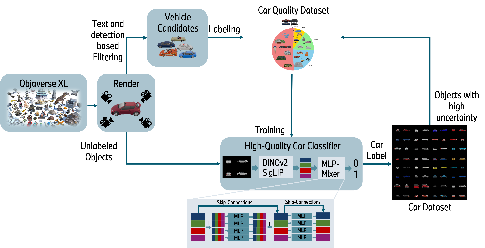

# MeshFleet Dataset Implementation and Car Quality Classification

🤗 **Huggingface Dataset**: [MeshFleet](https://huggingface.co/datasets/DamianBoborzi/MeshFleet)

This repository contains the implementation for the generation of the MeshFleet dataset, a curated collection of 3D car models derived from Objaverse-XL, using a car quality classification pipeline.



**Dataset Overview:**

The MeshFleet dataset provides metadata for 3D car models, including their SHA256 from Objaverse-XL, vehicle category, and size. The core dataset is available as a CSV file: [`meshfleet_with_vehicle_categories_df.csv`](https://huggingface.co/datasets/DamianBoborzi/MeshFleet). You can easily load it using pandas:

```python
import pandas as pd

meshfleet_df = pd.read_csv('./data/meshfleet_with_vehicle_categories_df.csv')
print(meshfleet_df.head())
```

The actual 3D models can be downloaded from [Objaverse-XL](https://github.com/allenai/objaverse-xl.git) using their corresponding SHA256 hashes.  Pre-rendered images of the MeshFleet models are also available within the Hugging Face repository in the `renders` directory, organized as `renders/{sha256}/00X.png`.

**Project Structure and Functionality:**

This repository provides code for the following:

1. **Data Preprocessing:**  Preparing the labeled objects (subset from Objaverse) for quality classification.
2. **Car Quality Classifier Training:** Training a model to predict the quality of 3D car models based on rendered images.
3. **Objaverse-XL Processing:** Downloading, rendering, and classifying objects from the larger Objaverse-XL dataset.
4. **Classification of Rendered Objects:** Applying the trained classifier to new renderings.

> Please Note: You don't have to clone or install the repository if you just want to use the extracted data. You can download the preprocessed data from the Hugging Face repository: <https://huggingface.co/datasets/DamianBoborzi/MeshFleet>

## Data Preprocessing

The preprocessing pipeline involves several key steps:

1. **Loading Labels:** Load the `car_quality_dataset_votes.csv` file from [CarQualityDataset](https://huggingface.co/datasets/DamianBoborzi/CarQualityDataset). This file contains quality labels (votes) for a subset of Objaverse objects, which serves as our training data.
2. **Loading/Generating Renderings:** Obtain rendered images of the labeled objects. You can either use the pre-rendered images from the same [CarQualityDataset](https://huggingface.co/datasets/DamianBoborzi/CarQualityDataset) repository or generate your own using the Objaverse-XL library.
3. **Embedding Generation:** Create image embeddings using DINOv2 and SigLIP models. These embeddings capture visual features crucial for quality assessment. We provide a notebook (`scripts/objaverse_generate_sequence_embeddings.ipynb`) to guide you through this process. Pre-generated embeddings will also be made available for download.
4. **Classifier Training** We use the generated embeddings and labels to train a classifier to predict the quality of 3D car models. The training script is `sequence_classifier_training.py`.
5. **Objaverse-XL Processing:** You can load, render, and classify 3D car models from the larger Objaverse-XL dataset, using the `oxl_processing/objaverse_xl_batched_renderer.py` script

### Installation

Before you begin, install the necessary dependencies:

```bash
pip install -r requirements.txt
pip install .
```

## Classifier Training

This section details the steps to train the car quality classifier.

1. **Load and Render Labeled Objects:**  Begin by loading the labeled objects from `data/car_quality_dataset_votes.csv`. Render the objects(if you haven't already downloaded pre-rendered images.
2. **Generate Embeddings:**  Use the `scripts/objaverse_generate_sequence_embeddings.ipynb` notebook to generate DINOv2 and SigLIP embeddings for the rendered images. Place the generated embeddings in the `data` directory. We will also provide a download link for pre-computed embeddings soon.
3. **Train the Classifier:** Train a classifier using the `quality_classifier/sequence_classifier_training.py` script. This script takes the embeddings as input and trains a model to predict object quality. Make sure to adjust the paths within the script if you're using your own generated embeddings. A pre-trained model will also be made available for download.

## Objaverse-XL Processing (Downloading, Rendering, and Classification)

To process objects from the full Objaverse-XL dataset:

1. **Use the `oxl_processing/objaverse_xl_batched_renderer.py` script:** This script handles downloading, rendering, and (optionally) classifying objects from Objaverse-XL.
2. **Refer to the `oxl_processing` directory:**  This directory contains all necessary files and a dedicated README with more detailed instructions.  Note that the full Objaverse-XL dataset is substantial, so consider this when planning storage and processing. You can also use the renders of the objects from the [Objaverse_processed](https://huggingface.co/datasets/DamianBoborzi/Objaverse_processed) repository (The renders are around 500 GB).

## Classification of Rendered Objects

To classify new renderings using the trained model:

1. **Download Pre-trained Models:** Download the trained classifier and the PCA model (used for dimensionality reduction of DINOv2 embeddings) from Hugging Face and place them in the `car_quality_models` directory.
2. **Prepare a CSV:** Create a CSV file containing the SHA256 hash and image path (`sha256,img_path`) for each rendered image you want to classify.
3. **Run `reclassify_oxl_data.py`:** Use the following command to classify the images:

    ```bash
    python reclassify_oxl_data.py --num_objects <number_of_objects> --gpu_batch_size <batch_size> [--use_combined_embeddings]
    ```

    * `<number_of_objects>`: The number of objects to classify.
    * `<batch_size>`:  The batch size for GPU processing.
    * `--use_combined_embeddings`:  (Optional) Use both DINOv2 and SigLIP embeddings for classification.
